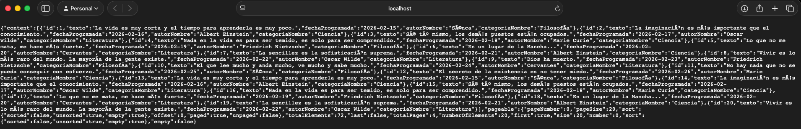
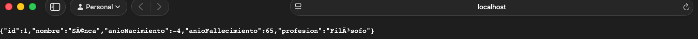
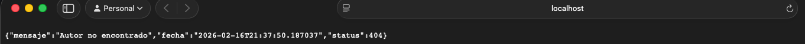

# 🏛️ API REST: Frases Célebres (Proyecto Final)

Este proyecto implementa una API RESTful completa con Spring Boot para la gestión de frases, autores y categorías.

---

## 📋 1. Requisitos Previos

Para ejecutar este proyecto necesitas:

- **Java 17** (JDK instalado y configurado).
- **Gradle 8.5** (O usar el wrapper incluido `./gradlew`).
- **PostgreSQL 15+** (Corriendo en el puerto **5433**).
- **Base de Datos**: Crear una base de datos llamada `frases_celebres`.

---

## 🚀 2. Puesta en Marcha

1.  **Clonar el repositorio** (si es necesario):

    ```bash
    git clone <url-del-repo>
    cd AccesoADatos
    ```

2.  **Configurar Base de Datos**:
    Asegúrate de que PostgreSQL está corriendo y la BD existe.
    Credenciales configuradas en `src/main/resources/application.properties`:
    - **URL**: `jdbc:postgresql://localhost:5433/frases_celebres`
    - **User**: `root`
    - **Pass**: `test`

3.  **Ejecutar la aplicación**:
    ```bash
    ./gradlew bootRun
    ```
    La aplicación iniciará en `http://localhost:8080`.

---

## 📸 3. Ejemplos de Uso (Capturas)

Aquí se muestran ejemplos de llamadas a la API funcionando:

### A. Listar Frases (GET /api/v1/frases)



### B. Detalle de Autor (GET /api/v1/autores/{id})



### C. Error Controlado (404 Not Found)



---

## 🔐 4. Usuarios y Seguridad

La API utiliza **Basic Auth**. Existen dos usuarios preconfigurados:

| Rol             | Usuario    | Contraseña    | Permisos                                    |
| :-------------- | :--------- | :------------ | :------------------------------------------ |
| 👑 **ADMIN**    | `admin`    | `admin123`    | Control total (Leer, Crear, Editar, Borrar) |
| 👤 **STANDARD** | `standard` | `standard123` | Solo lectura (Consultas GET)                |

---

## 📚 5. Documentación API (Swagger/OpenAPI)

La documentación interactiva generado automáticamente está disponible en:

👉 **[http://localhost:8080/swagger-ui.html](http://localhost:8080/swagger-ui.html)**

Desde ahí puedes probar todos los endpoints (`/api/v1/...`) directamente desde el navegador.
